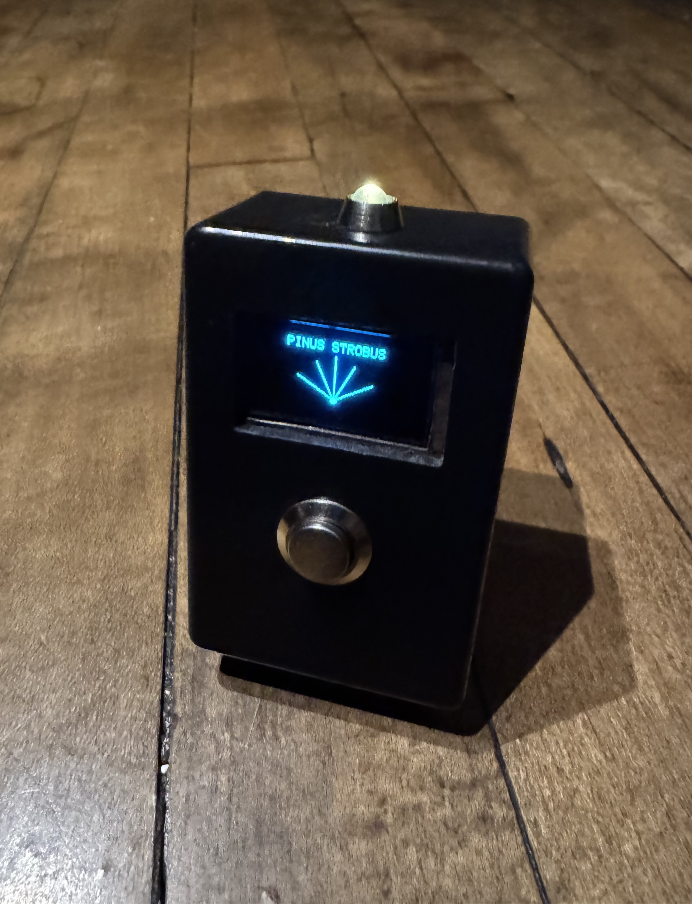
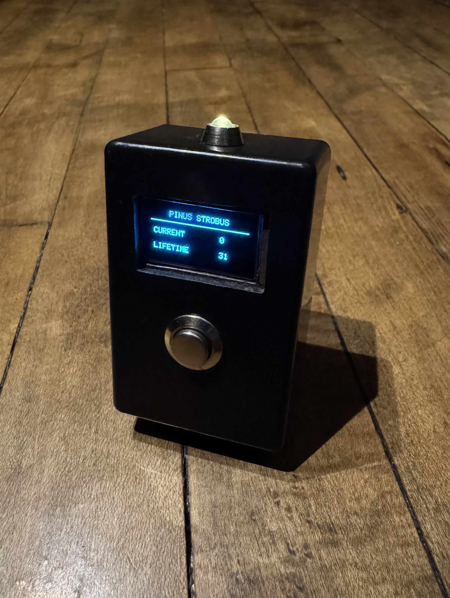
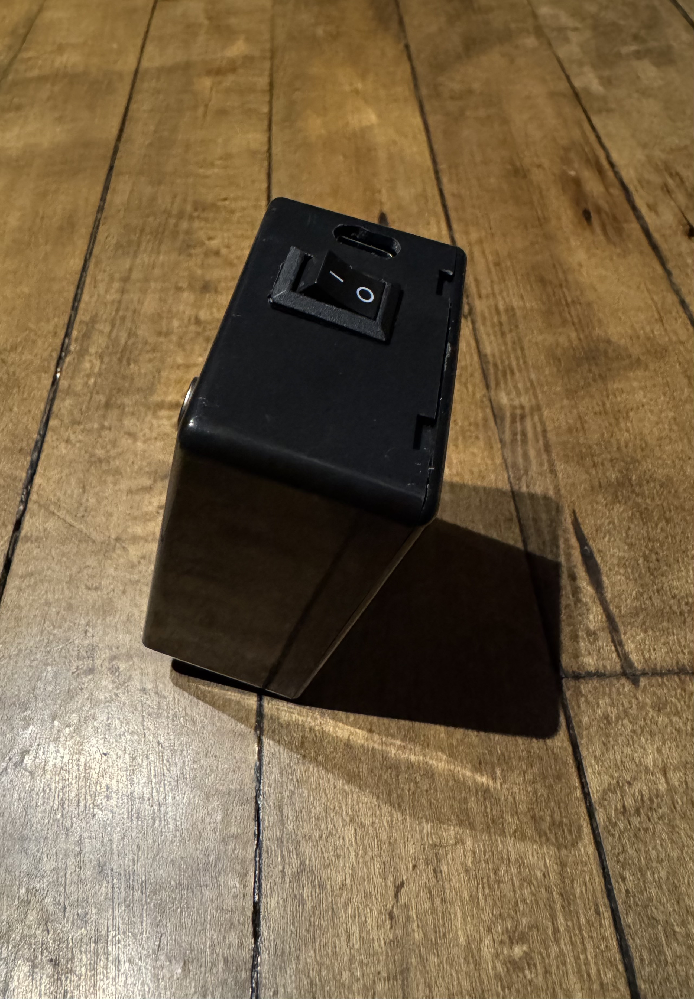
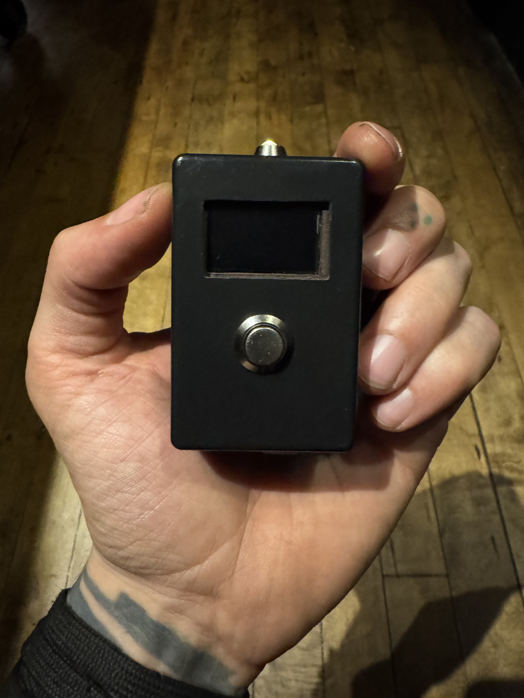

# White Pine

A handheld counter for tracking sightings of Eastern White Pine (*Pinus strobus*).

## Overview

White Pine is a small battery-powered device built for counting sightings of a single tree species.

Each time an Eastern White Pine is spotted, the user presses the button and the count increases.

The device stores:

- current session count
- lifetime total count

A short press increments the count.

A long press wakes the display and shows the stored totals.

---

## Prototype

---

## Why

White Pine started as a simple species-specific counter, but the project became more interesting once the design was narrowed down.

The device does not identify trees or automate observation. It only records sightings the user actively notices. That limitation is the point.

Because of that, several design choices stayed intentionally simple. The display remains off during normal counting, no timestamps or GPS data are stored, and the device keeps only the total counts.

The goal is to support observation without adding unnecessary features or pulling attention away from the environment.

---

## Features

- Lifetime sighting counter
- Current session counter
- Rechargeable battery
- OLED display
- Pocket-sized enclosure
- Single-button input
- Persistent storage

---

## Hardware

Current prototype uses:

- D1 Mini (ESP8266)
- 0.96" OLED display
- Metal momentary button
- Side-mounted LED
- Rocker power switch
- LiPo battery
- Micro LiPo charger
- MT3608 boost converter

Most of the prototype was built using salvaged or spare parts.

---

## Behavior

### Short Press

Increments the sighting count.

The display remains off.

---

### Long Press

Shows:

- current session total
- lifetime total

---

## Design Notes

The display stays off during normal counting to reduce distraction and conserve power.

Only aggregate counts are stored.

No historical logs, timestamps, or location data are recorded.

The device is designed for repeated field use with minimal interaction.

---

## Repository Contents

- [Hardware](docs/HARDWARE.md)
- [Wiring](docs/WIRING.md)
- [Firmware](docs/firmware/white-pine-v1.ino)

---

## License

MIT

---

Built under Feral Engineering.

